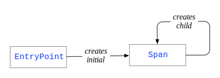

# Entry Points

An `EntryPoint` provides a way to create a root `Span`, or continue a `Span` that began on another computer. In practice this means that an entry point is a live connection to some tracing back-end. This is where you start: typically `IOApp.run` will construct an entry point that you use for the life of your program.



## Obtaining an Entry Point

You can obtain an `EntryPoint` through a vendor-specific factory, which (as in the example below) may require some knowledge of the underlying API.

For example, here is a method that constructs a `Resource` yielding a Jaeger entry point.

```scala mdoc
import natchez._
import natchez.jaeger.Jaeger

import cats.effect._
import io.jaegertracing.Configuration.ReporterConfiguration
import io.jaegertracing.Configuration.SamplerConfiguration
import java.net.URI

def entryPoint[F[_]: Sync]: Resource[F, EntryPoint[F]] =
  Jaeger.entryPoint[F](
    system    = "natchez-example",
    uriPrefix = Some(new URI("http://localhost:16686")),
  ) { co => // (1) Configuration => F[NativeJaegerTracer]
    Sync[F].delay {
      co.withSampler(SamplerConfiguration.fromEnv)
        .withReporter(ReporterConfiguration.fromEnv)
        .getTracer
    }
  }
```

The function argument at (1) provides a Jaeger configuration, which must be materialized into a native Jaeger tracer. In this way the `EntryPoint` factory provides access to the underlying tracing library, and this pattern appears in various ways for all the back ends.

## Creating an Initial Span

